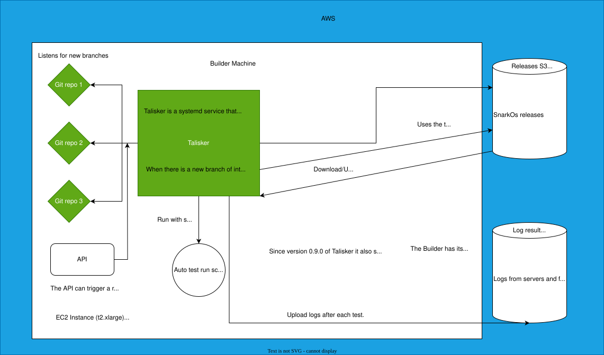

# Aleo SnarkOS Stress Testing Manager and stress tests Tester

A machine that can react to new SnarkOS releases and can build a SnarkOS binary which than can be used and reused
to run the stress tests.

## Creating the Stress Testing Manager

### Base AMI dependency

The Stress Testing Manager uses its own base AMI image (can be build using the scripts int he `packer` folder).
The image is based on Ubuntu 22 and includes a lot of tools for debugging and building SnarkOS.
It contains Rust/Cargo, AWS cli, git, Ansible and Terraform.

It is prebuild in the AWS snadbox (`us-east-1`, `099720109477`), but that can be modified to be built in
another region and account. Just modify the region in `packer/image.json.pkr.hcl`, export your `AWS_ACCESS_KEY_ID` and
`AWS_SECRET_ACCESS_KEY` in the current terminnal and navigate to the `packer` folder. Run:

```
export AWS_REGION=us-west-2
packer init image.json.pkr.hcl
packer build image.json.pkr.hcl
```

Then add your account to the list in `infrastructure/base_ami.tf` on line `4`. Now the image will be available for your
account too.

### Preparations

The terraform run will require environment variables. It is recomended to keep a `.env` file in the infrastructure folder like:

```
export TF_VAR_SLACK_CHANNEL_ID="<value>"
export TF_VAR_SLACK_TOKEN="<value>"

export TF_VAR_github_token="<value>"

export TF_VAR_ELASTIC_CLOUD_ID="<value>"
export TF_VAR_ELASTIC_API_KEY="<value>"
export TF_VAR_GRAFANA_CLOUD_API_KEY="<value>"

export TF_VAR_DEVNET_NAME="<value>"
```

Just source it before the run:

```
source .env
```

There is a file with pub keys that will be added to the `authorized_keys` of the new server, if yours is not there,
add it to it, the logic is written in a way it won't duplicate a key. The key has to be added in:

```
stress-testing-manager/infrastructure/ansible/templates/extra_keys.pub
```

Can be done like in this example:

```
echo `cat ~/.ssh/id_rsa.pub` >> stress-testing-manager/infrastructure/ansible/templates/extra_keys.pub
```

### Running terraform

Navigate to `infrastructure` and run:

```
terraform apply
```

This will create the Stress Testing Manager using the base image from the previous section as base.
What does that include?
1. A machine of type `t2.xlarge` with 100GB of storage (to store logs and binaries).
2. A profile giving the machine a lot of rights in AWS - to create and destroy instances, access S3, create and destroy networks, etc. This is needed so stress tests can be ran from it and these tests create instances and a network, read things from S3, etc. The whole list of accesses can be viewd in `infrastructure/ec2_profile.tf`, line `19`.

Keep in mind that in order to create the Stress Testing Manager, first you need to export `TF_VAR_AWS_ACCESS_KEY` and `TF_VAR_AWS_SECRET_KEY`.
Additionally you need a github token with read access to this repository (so the stress-testing-manager can download the tests). Export it with `TF_VAR_github_token`.

By default, the setup uses the ssh key `id_ed25519.pub` in `~/.ssh/`. You can overwrite this with `TF_VAR_PUBLIC_KEY_PATH=...`.

### Provisioning with Ansible

You don't need to run Ansible yourself. The provisioning automatically kicks in via the `terraform apply` command.
The playbook is defined in `infrastructure/ansible/playbook.yml`.
It does:

1. Downloads the stress tests from `github.com/ProvableHQ/stress-testing.git` and puts them in the folder `stress_testing` (the `ubuntu` user home is the base for all of these resources).
2. Installs python (needed for Ansible and AWS cli/S3 access). It is in the base image, but that will update it to newest.
3. Downloads the `talisker` source from `https://github.com/ProvableHQ/talisker` and compiles it, releases it, installs it in `/home/ubuntu/bin/talisker`.
4. Runs `talisker` as a service (this is the software that detects new releases, kicks the builds, puts the binaries at accessible places, manages the test runs and retries and uploads the logs from them).
5. Sets up the right test vars that are specific for the automated runs.
6. By default a local API is ran at port `3030` for talisker its documentation can be found [here](https://github.com/ProvableHQ/talisker/blob/master/README.md#using-the-internal-api)

## Removing the Stress Testing Manager

The stress-testing-manager is stateless, so it can be removed and created whenever we decide to do so.
Just run:

```
terraform destroy
```

in the `infrastructure` folder.


## Updating the Stress Testing Manager

Just run again:

```
terraform apply
```

in the `infrastructure` folder.

This will evaluate the ansible playbook again in addition to any infrastructure changes, meaning the newest Talisker
will get intalled and the newest version of the tests will get pulled.

## The stress-testing-manager logic

<!-- SVG can be modified with app.diagrams.net -->

The Stress Testing Manager machine is running a service called Talisker, a systemd service that can be controlled with (for example):

```
sudo service talisker stop
sudo service talisker start
```

A way to check its logs is:

```
journalctl -efu talisker
```

### Listening to new branches/tags

Talisker uses a mechanism to ping repositories that were configured to be pinged and if there are new new branches or tags to react to them.
It only reacts to specific naming of these tags/branches (configured with regex).

### Building SnarkOS

The stress-tests/network sync test logic builds and stores built versions of SnarkOS, Talisker just provides the right env variables, features and tags/git hashes.

### Testing a version

For every repository a list of tests can be configured. This tests are ranned in the following manner:

1. Talisker uses the auto script to create the infrastructure for the tests.
2. Every test is ran by talisker, if the test fails, Talisker retries it a few times (configurable how many) and uploads the run log and all the node logs to the test results bucket. Talisker also keeps where it is in the test runs in a file DB, so if something killes it, it can continue from where it was left off.
3. The uploaded test if it didn't pass with 0 return code is marked as `FAILED` in the results.
4. After all the tests, Talisker cleans up the infrastructure using the auto script.

To cancel a Talisker run, just:
1. Stop talisker `sudo service talisker stop`
2. Remove the current run log file, as it can be added to in a next run, resulting in dirty log (and also it is used as a lock to not try and run another test).
3. Do a manual cleanup `cd stress_testing/test_suites/single-region-tests/` and then `./auto_run_test_suite.sh cleanup`
4. After you are done with manually running tests or other things, start Talisker.
